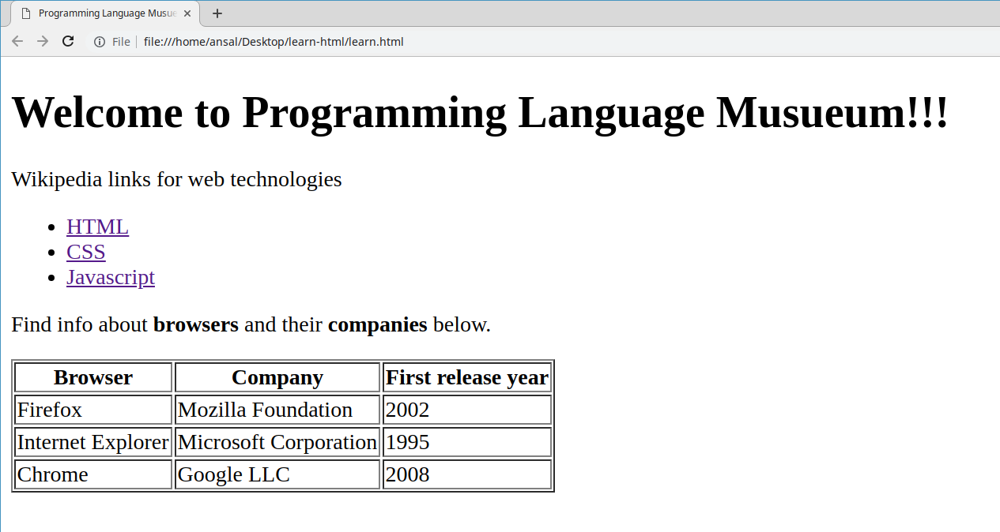

# Week 1 Assignments

## Day 1
#### Fork attainu-pheonix repo, commit and issue a pull request.
1. Signup for a github.com account
2. Fork [https://github.com/attainu-phoenix/attainu-phoenix](https://github.com/attainu-phoenix/attainu-phoenix)
3. Create a file named `why_i_want_to_be_a_coder.md` inside `assignments` folder.
4. Write a short note in the file why you want to be a coder? :)

## Day 2
#### Create an HTML document that looks like the below image.
1. You can either do it on codepen and send us a link or commit to a github repo.

